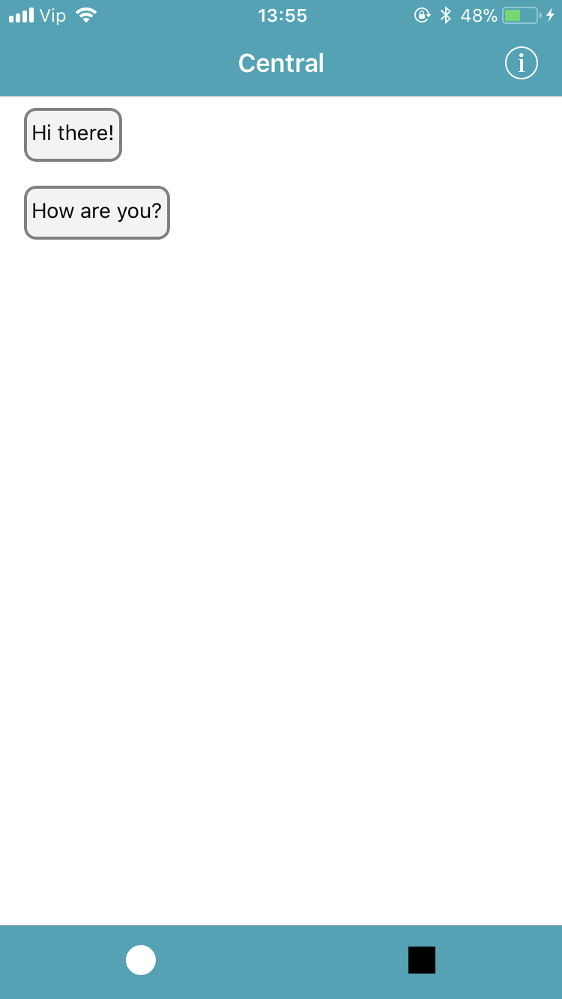

# TrainingBluetooth

TrainingBluetooth is a Chat App based on Bluetooth.
Pair two devices and act as central/peripheral and send masseges to each other.
Whole App is made without Storyboards, only code with AutoLayout.
#
Central screen:
- Shows a collectionView with recived messages\n 
- Info button for status of  Bluetooth connection, device and RSSI value

   
#
Peripheral screen:
- Shows a collectionView with sended messages
- Custom inputAccessoryView 

   

